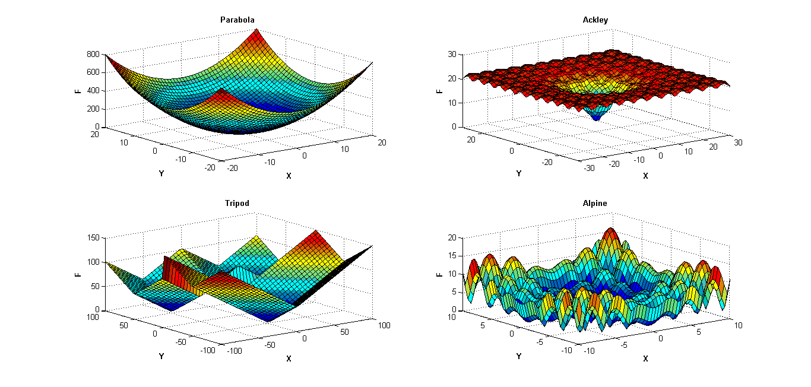

# Metaheuristic Minimization Using Population-Based Simulated Annealing

## Features

- The code has been written and tested in Python 3.8.8.
- Population-based Simulated Annealing (SA) implementation for metaheuristic
  minimization.
- Variables can be real, integer, or mixed real/integer.
- Variables can be constrained to a specific interval or value setting the lower and the upper boundaries.  
- Neighboroud search is performed using a normal distribution along randomly chosen dimensions.
- A nonlinear decreasing schedule is used for the temperature and for the standard deviation in the neighboroud search.
- Search space can be normalized to improve convergency.
- To improve the execution speed the algorithm has been designed removing almost all loops on the agents.
- An arbitrary number of parameters can be passed (in a tuple) to the function to minimize.
- Usage: *python test.py example*.

## Main Parameters

`example` Name of the example to run (Parabola, Alpine, Tripod, and Ackley.)

`func` Function to minimize. The position of all agents is passed to the function at the same time.

`LB`, `UB` Lower and upper boundaries of the search space.

`nPop`, `epochs` Number of agents (population) and number of iterations.

`T0` Initial temperature.

`alphaT` Temperature reduction rate.

`alphaS` Standard deviation (neighboroud search) reduction rate.

`nMove` Number of neighbours of a state evaluated at each epoch.

`prob` Probability the dimension of a state is changed.

`sigma0` Initial standard deviation used to search the neighboroud of a state.

`IntVar` List of indexes specifying which variable should be treated as integer. If all variables are real set `IntVar=None`. Indexes are specified in the range `(1,nVar)`.

`normalize` Specifies if the search space should be normalized (to improve convergency).

`args` Tuple containing any parameter that needs to be passed to the function to minimize. If no parameters are passed set `args=None`.

`nVar` Number of variables (dimensions of the search space).

`Xsol` Solution to the minimization point. Set to `None` if not known.

## Examples

There are four examples: Parabola, Alpine, Tripod, and Ackley (see *test.py* for the specific equations and parameters). As illustration, a 3D plot of these functions is shown below.

- **Parabola**, **Alpine**, and **Ackley** can have an arbitrary number of dimensions, while **Tripod** has only two dimensions.

- **Parabola**, **Tripod**, and **Ackley** are examples where parameters (respectively, array `X0`, scalars `kx` and `ky`, and array `X0`) are passed using `args`.

- The global minimum for **Parabola** and **Ackley** is at `X0`; the global minimum for **Alpine** is at zero; the global minimum for **Tripod** is at `[0,-ky]` with local minimum at `[-kx,+ky]` and `[+kx,+ky]`.

## Reference

- Wikipedia, "[Simulated Annealing](https://en.wikipedia.org/wiki/Simulated_annealing)".
- Kirkpatrick et al., 1983, "[Optimization by Simulated Annealing](https://www.jstor.org/stable/1690046)", JSTOR.
- Jamil and Yang, 2013, "[A Literature Survey of Benchmark Functions For Global Optimization Problems](https://arxiv.org/abs/1308.4008)", arVix.
